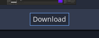

# Godot MIDI Keyboard
For Godot 4.2.1

Result of some experimenting with Godot, MIDI, and soundfonts.

The application should detect connected MIDI devices and read their output. It can also read MIDI files and play them back on the keyboard.

[Try it on itch.io](https://maaack.itch.io/godot-midi-keyboard)

  
  
  
  
  
## Plugins
This Godot project requires the following plugin(s):

1. `Godot MIDI Player for Godot Engine 4` by arlez80.

### Installation
1. Open the Asset Lib window in Godot.
   * 
2. Make sure you are searching `godotengine.org`.
   * 
3. Search for "MIDI" and select `Godot MIDI Player for Godot Engine 4`.
4. In the details window for the plugin, select download.
   * 
5. Let the plugin download and then start the install...
6. Let the plugin install in `/addons/midi`.
    * 
7.  Open the Project Settings window and select the Plugins tab.
8.  Under the column "Status", check the boxes to Enable the plugins.
    * 
9.  Reload the project.
    * 

## Links
[Attribution](ATTRIBUTION.md)  
[License](LICENSE.txt)  